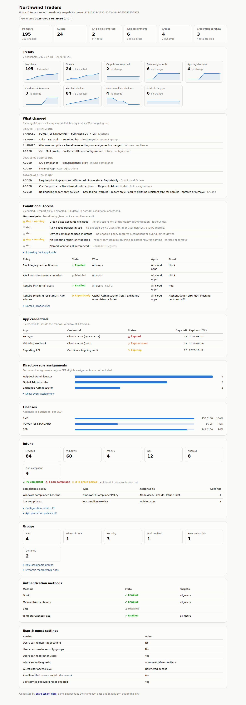

# Entra Tenant Docs

Living documentation for your Entra ID tenant. One read-only PowerShell script, four outputs from the same timestamped snapshot:

| Output | Who it's for |
|---|---|
| `docs/` — 10 numbered Markdown files | Admins, auditors, change records. Deterministic output with no timestamps in the section files, so **committing the folder to git turns every re-run into a config-drift diff.** Includes a computed change log. |
| `tenant.json` | Anything you build on top — the complete structured snapshot. |
| `report.html` | Everyone else. A self-contained, timestamped report — KPI tiles, trend sparklines, a "what changed" feed, license meters, credential-expiry status, Conditional Access at a glance. No server, no dependencies; open it in a browser, drop it on an intranet share. |
| `history/` | One JSON snapshot archived per run — the raw material behind trends and the change log. |
| `run-summary.json` | This run's delta in machine-readable form — what `Send-TenantDocsAlert.ps1` (and anything else you automate) consumes. |



<sub>Dark mode: [screenshot-dark.png](screenshot-dark.png)</sub>

Built by an IT manager who got tired of tenant knowledge living in twelve portal blades and zero documents.

## Try it in 30 seconds (no tenant needed)

```powershell
.\Export-EntraTenantDocs.ps1 -SampleData -OutputPath .\demo
```

Renders the bundled sample tenant — open `demo\report.html` and browse `demo\docs\`.

## Document a real tenant

```powershell
Install-Module Microsoft.Graph.Authentication -Scope CurrentUser   # the only module it needs
.\Export-EntraTenantDocs.ps1                                       # connects, collects, writes .\tenant-docs\
```

Required scopes (all read-only): `Directory.Read.All`, `Policy.Read.All`, `RoleManagement.Read.Directory`, `Application.Read.All` — plus, for the Intune section, `DeviceManagementConfiguration.Read.All`, `DeviceManagementManagedDevices.Read.All`, `DeviceManagementApps.Read.All` (skip them and the section degrades; `-SkipIntune` skips the attempt entirely). Everything is raw `Invoke-MgGraphRequest` calls — no dependency on the twenty-odd Graph submodules.

Re-render offline from a previous snapshot (no connection, byte-identical output):

```powershell
.\Export-EntraTenantDocs.ps1 -FromJson .\tenant-docs\tenant.json -OutputPath .\rerender
```

### Sharing the output outside the tenant

`-Anonymize` replaces identifying values in the output with stable pseudonyms, so you can put the report in a deck, a portfolio, or a ticket with a vendor.

```powershell
.\Export-EntraTenantDocs.ps1 -Anonymize -OutputPath .\shareable
```

Replaced: tenant and app IDs, the organization name, domains, every person's display name and UPN, group names, non-Microsoft app names, named-location names, app-registration and credential names, Intune assignment groups, and the string literals inside dynamic membership rules — `(user.department -eq "Sales")` becomes `(user.department -eq "value-411105")`, so the rule's shape survives while its contents don't.

Kept, because the shape is the whole point: every count, license SKU part numbers, built-in role names, policy states, grant and session controls, platforms, client app types, Intune types and setting keys, and dates. A report where everything is redacted proves nothing.

Two things worth knowing before you hand it over:

- **Policy names are kept.** Conditional Access and Intune policy names are left exactly as written, so the gap analysis stays readable — `satisfied by 'Require MFA for all users'` beats `satisfied by 'Policy 2c9f'`. They are admin-authored free text, so read them first: a policy called `Block legacy auth except svc-vendorname` will say so. Tightening this is the next piece of work on the switch.
- **The salt is fresh on every run**, so nobody holding the output can confirm a guessed name by re-deriving its pseudonym. That also means two separately generated reports won't line up. `-AnonymizeSalt <string>` pins it when you need them to, at the cost of that protection.

The history archived on disk is **not** anonymized — only the rendered output is — so your own drift history stays real and readable. Every snapshot loaded in a run shares one mapping table, so the change log and trends stay coherent instead of reporting every admin as removed-and-re-added.

The report and `docs/index.md` say plainly that they are anonymized. Pseudonyms that look like real values without saying so would be a worse problem than the one this solves.

### History, trends, and the change log

Every run archives its snapshot to `history/` (default: under the output folder; `-HistoryPath` moves it, `-NoHistory` skips archiving). From two snapshots onward:

- **Trends** appear in the report — sparklines for members, guests, enforced CA policies, role assignments, app registrations, and credentials in the renewal window, each with its change since the previous snapshot.
- **What changed** appears in the report and in `docs/09-changelog.md` — the computed diff between snapshots, in English: who got a role, which CA policy flipped state, which dynamic rule was edited, what got bought.

Schedule it weekly and the change log writes itself:

```powershell
cd tenant-repo
Export-EntraTenantDocs.ps1 -OutputPath .
git add docs tenant.json history; git commit -m "Tenant snapshot $(Get-Date -Format yyyy-MM-dd)"
git diff HEAD~1 -- docs      # the same drift, as a raw diff
```

### Scheduled runs with alerts

`Send-TenantDocsAlert.ps1` turns a run into a notification — **only when something is worth saying**: the tenant changed, or an app credential is now expired. Quiet runs send nothing, so nobody learns to ignore the channel.

- **Teams** — posts an Adaptive Card to a Power Automate **Workflows** webhook (in Teams: channel → Workflows → *"Post to a channel when a webhook request is received"*, copy the URL). Legacy Office 365 connector webhooks were retired in May 2026; this targets the Workflows format only.
- **Email** — plain text through your internal SMTP relay (unauthenticated relay; no credentials stored anywhere).

Keep the webhook URL out of scripts and task definitions — set it once in the `TENANTDOCS_TEAMS_WEBHOOK` environment variable (machine scope for scheduled tasks).

```powershell
# run.ps1 - the scheduled pair
& $PSScriptRoot\Export-EntraTenantDocs.ps1 -OutputPath C:\tenant-docs
& $PSScriptRoot\Send-TenantDocsAlert.ps1 -RunSummaryPath C:\tenant-docs\run-summary.json -ReportLink '\\fileserver\it\tenant\report.html'
```

```
schtasks /Create /TN "Tenant docs weekly" /SC WEEKLY /D MON /ST 07:00 /TR "pwsh -NoProfile -File C:\tools\tenant-docs\run.ps1"
```

One thing interactive runs hide: a scheduled task can't answer a sign-in prompt. For unattended runs, register an app with the four read scopes as **application** permissions and connect with a certificate before the export (`Connect-MgGraph -ClientId <id> -TenantId <id> -CertificateThumbprint <thumb>`) — the export uses whatever Graph session already exists. `-AlwaysNotify` turns the alert into a daily digest if you prefer a heartbeat.

## What gets documented

1. **Tenant** — org info, verified domains, license SKUs (purchased/assigned/available)
2. **Conditional Access** — every policy rendered readable (users, groups, roles, apps, platforms, locations, client apps, risk, grant and session controls — GUIDs resolved to names), named locations, and a **10-check gap analysis**: MFA for all users, legacy auth blocked, admin MFA coverage, CA-vs-security-defaults, break-glass exclusions, guest coverage, risk-based policies, device-based grants, lingering report-only policies, unused named locations. Gap open/close transitions land in the change log — so a posture regression fires the Teams alert
3. **Directory roles** — permanent assignments per role
4. **Groups** — counts by type, role-assignable groups, every dynamic membership rule verbatim
5. **Authentication methods policy** — which methods are enabled, for whom
6. **User & guest settings** — the authorization policy in plain English (who can invite guests, who can register apps, guest access level)
7. **App registrations** — sign-in audience and credential expiry, soonest first
8. **Intune** — managed-device overview by platform, compliance state summary, compliance policies (scalar settings and assignments, group GUIDs resolved), configuration profiles, app protection policies. Degrades gracefully when the tenant has no Intune (or use `-SkipIntune`)
9. **Change log** — computed by diffing consecutive snapshots: CA policies added/removed/state-changed, role assignments granted/revoked, purchased-license changes, dynamic-rule edits, auth-method toggles, setting flips, app registrations added/removed, Intune policy/profile changes

## How this differs from the existing tools

- [**EntraExporter**](https://github.com/microsoft/EntraExporter) (Microsoft) exports the tenant as raw JSON — excellent for backup and version tracking, but nobody can hand `conditionalAccessPolicies.json` to a manager. This tool's output is documentation first.
- [**Microsoft365DSC**](https://microsoft365dsc.com/) manages configuration as code — far more powerful, and a correspondingly bigger commitment. This tool is one script you can run in five minutes with read-only scopes.

If you need backup/restore or config enforcement, use those. If you need *current, readable docs and a shareable report*, this is the gap this fills.

## Honesty notes

- **Read-only.** Every call is a GET (plus one `getByIds` POST that only resolves object IDs to display names). The export changes nothing in the tenant; the alert script is the only component that sends anything anywhere — to *your* webhook and *your* relay.
- Tested for syntax and structure against mocked Graph data; **not yet run against a production tenant** — dev tenant first, as with anything that touches Graph.
- **PIM eligible assignments are not included** — the roles section reads permanent assignments only. Group-based role assignments are listed as the group, not expanded to members.
- Secret *values* never appear anywhere — Graph doesn't return them; only credential names and expiry dates are documented.
- **`-Anonymize` is not a guarantee.** It replaces the categories listed above, and it deliberately keeps Conditional Access and Intune policy names so the gap analysis stays readable. Those are free text an admin wrote, and free text is where surprises live. Read the output before you share it; don't treat the switch as permission to skip that.
- The CA gap checks are **opinionated baseline hygiene, not a compliance audit** — they encode common guidance (require MFA broadly, block legacy auth, keep break-glass exclusions), and a well-run tenant can still have legitimate reasons to differ.
- Coverage is the identity plane plus Intune's v1.0 surface. Exchange, SharePoint, and Teams settings live behind different APIs and are on the roadmap, not in the script.
- **Settings catalog policies are not documented** — that Intune API is still beta-only in Microsoft Graph, and this tool sticks to v1.0. The classic compliance policies and configuration profiles are covered.

## Tests

```bash
./tests/run-tests.sh          # needs pwsh, python3, and playwright for the HTML check
```

31 checks. The one that matters is the leak scan: it harvests every identifying string from the sample snapshot *and* every history snapshot the run reads, then greps all four output types for them and requires zero hits — plus a positive control that SKUs, role names, policy names and counts are still there, since an anonymizer that redacts everything would otherwise pass. The rest cover determinism under a fixed salt, structural parity against the clear render, coherence of the change log across anonymized history, a mocked live run proving the archive keeps real values while the same run's output does not, graceful degradation on snapshots with no Intune or no roles, and executing `report.html` in a real browser to prove it actually renders — the docs and the report take different code paths, and only running the page catches a payload that is valid JSON and silently broken.

## Roadmap

- Intune settings catalog policies (when the API reaches Graph v1.0)
- Harden `-Anonymize`: an option to pseudonymize Conditional Access and Intune policy names too, for output going somewhere you don't control

## Related tools

Same author, same philosophy (small, honest, read-only by default): [entra-lifecycle-toolkit](https://github.com/JonathanT10/entra-lifecycle-toolkit) · [m365-license-waste-report](https://github.com/JonathanT10/m365-license-waste-report) · [entra-security-snapshot](https://github.com/JonathanT10/entra-security-snapshot) · [print-fleet-dashboard](https://github.com/JonathanT10/print-fleet-dashboard)

## License

MIT — see [LICENSE](LICENSE).
